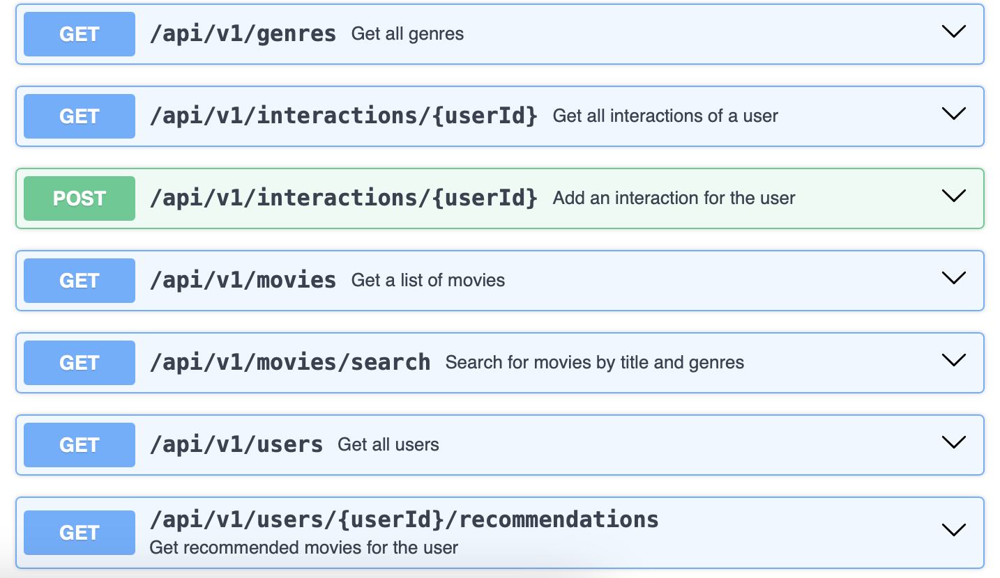
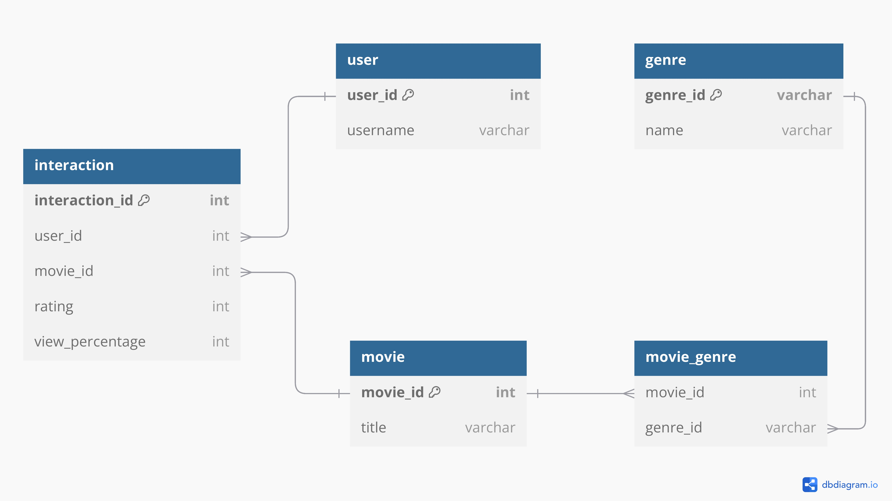
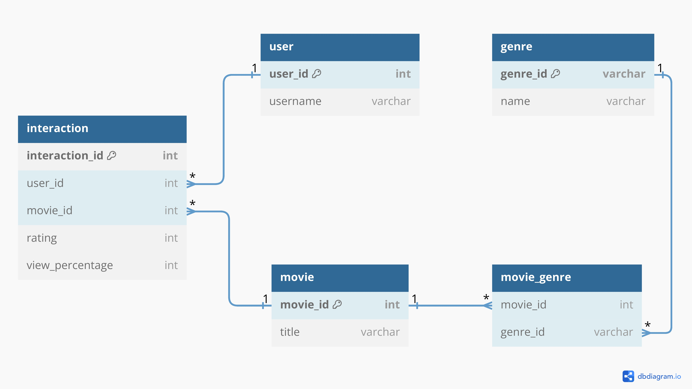

# Recommendation

This project is a movie recommendation service built using Spring Boot with Gradle. It provides functionalities to:

	•	Recommend movies based on user preferences and ratings.
	•	Search movies by title, genres, or keywords.
	•	Monitor service metrics and logs for improved reliability and observability.

The application uses a relational database to manage movies, genres, users, and their interactions, offering a seamless and personalized user experience.


## Technologies

This project is built using the following technologies:

	•	Java 21
    •	Spring Boot
	•	Gradle
	•	SQLite

SQLite was chosen for this project because it is simple, lightweight, and well-suited for testing purposes. **Each time the Spring Boot application is started, the database is automatically overwritten with the records contained in the provided CSV files**. The database will be saved in the mydatabase.db file, ensuring a consistent, fresh state for testing without the need for a complex database setup.
## How to run

You can run the application using either Docker Compose or Gradle.

#### Using Docker Compose

To run the application with Docker Compose, use the following command:

```
docker compose up --build
```

This will start the Spring Boot application locally at http://localhost:8080

#### Using Gradle

To run the application with Docker Compose, use the following command:

```
./gradlew bootRun
```

This will start the Spring Boot application locally at http://localhost:8080
## APIs

The API documentation is available through the Swagger file located at:

	•	/docs/swagger.yaml

This file contains the full API specification, including all available endpoints and their details.


## DB Schema

The database schema is available in PDF format at the following location:

	•	/docs/schema.pdf

This file contains the full schema diagram and details of the database structure.



## Initial data

The initial data for the project is provided in CSV files, located under the /csv directory. **Each time the application starts, the database is overwritten with the same data from these CSV files through the /resources/data.sql file**, ensuring a consistent starting point every time the project is run.

This setup allows for a predictable and reproducible environment for testing and development.
## Logging

The application writes logs to a file located at:

	•	/logs/app.log

This log file contains information about the application’s operations, including requests, errors, and other events, which can be helpful for monitoring and debugging.

## Authors

- [@Pierluca Lippi](https://www.linkedin.com/in/pierluca-lippi/)